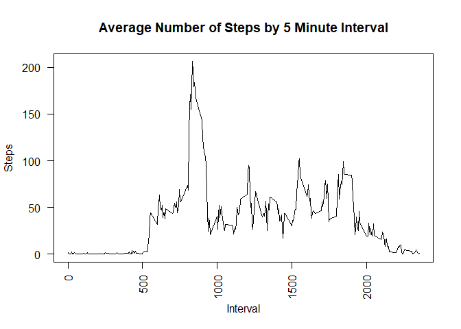

## Loading and preprocessing the data
* load required packages to do the analysis
* import the data into R using read.csv
* parse dates using lubridate


```r
library(dplyr)
library(lubridate)
library(zoo)
data <- read.csv("activity.csv")
data$date <- ymd(data$date)
```

## What is mean total number of steps taken per day?
* group data by date
* summarize total steps per day and display result
* plot a histogram of total steps per day and display result
* calculate the mean and median steps per day and display result


```r
bydate <- group_by(data, date)
totalperday <- summarize(bydate, total_steps_per_day = sum(steps, na.rm = TRUE))
totalperday
```

```
## # A tibble: 61 x 2
##    date       total_steps_per_day
##    <date>                   <int>
##  1 2012-10-01                   0
##  2 2012-10-02                 126
##  3 2012-10-03               11352
##  4 2012-10-04               12116
##  5 2012-10-05               13294
##  6 2012-10-06               15420
##  7 2012-10-07               11015
##  8 2012-10-08                   0
##  9 2012-10-09               12811
## 10 2012-10-10                9900
## # ... with 51 more rows
```

```r
hist(totalperday$total_steps_per_day, main = "Histogram of Total Steps per Day", xlab = "Steps per Day")
```

<!-- -->

```r
summary(totalperday$total_steps_per_day)
```

```
##    Min. 1st Qu.  Median    Mean 3rd Qu.    Max. 
##       0    6778   10395    9354   12811   21194
```

## What is the average daily activity pattern?
* group data by 5-minute interval
* summarize mean of steps by interval across all days
* plot mean of steps by interval across all days and display result
* determine the 5-minute interval on average across all days, that contains the max steps and display result


```r
byinterval <- group_by(data, interval)
meanperinterval <- summarize(byinterval, mean_steps_per_interval = mean(steps, na.rm = TRUE))
plot(meanperinterval, type="l", ylab = "Steps", xlab = "Interval", las=2, main="Average Number of Steps by 5 Minute Interval")
```

<!-- -->

```r
x <- which(meanperinterval$mean_steps_per_interval == max(meanperinterval$mean_steps_per_interval))
meanperinterval$interval[x]
```

```
## [1] 835
```

## Imputing missing values
* calculate number of missing values in data set and display result
* create data frame replacing NAs with value in row above using na.locf function
* plot a histogram of total steps per day with new data frame and display result
* calculate the mean and median steps per day with new data frame and display result


```r
sum(is.na(data$steps))
```

```
## [1] 2304
```

```r
data2 <- data
data2[1,1] <- as.integer(0)
data2 <- na.locf(data2)
data2$steps <- as.integer(data2$steps)
bydate2 <- group_by(data2, date)
totalperday2 <- summarize(bydate2, total_steps_per_day = sum(steps))
hist(totalperday2$total_steps_per_day, main = "Histogram of Total Steps per Day (Replacing NAs)", xlab = "Steps per Day")
```

<!-- -->

```r
summary(totalperday2$total_steps_per_day)
```

```
##    Min. 1st Qu.  Median    Mean 3rd Qu.    Max. 
##       0    6778   10395    9354   12811   21194
```

## Are there differences in activity patterns between weekdays and weekends?
* add a column to data2 for day of the week using weekdays function
* add a column to designate weekday or weekend using ifelse function and convert to factor
* group data by weekday or weekend factor and interval
* summarize data by mean of steps
* split into two data frames for plotting and remove first column
* plot together in a panel of 1 column and 2 rows


```r
data2$date <- ymd(data2$date)
data2$weekday <- weekdays(data2$date)
data2$weekend <- ifelse (data2$weekday == "Saturday" | data2$weekday == "Sunday", "Weekend", "Weekday")
data2$weekend <- as.factor(data2$weekend)
data2grouped <- group_by(data2, weekend, interval)
data2summary <- summarize(data2grouped, mean_steps_per_interval = mean(steps))
data2weekday <- data2summary[data2summary$weekend == "Weekday",]
data2weekend <- data2summary[data2summary$weekend == "Weekend",]
data2weekday <- data2weekday[,2:3]
data2weekend <- data2weekend[,2:3]
par(mfrow=c(2,1))
plot(data2weekday, type="l", ylab = "Steps", xlab = "Interval", las=2, main="Weekday")
plot(data2weekend, type="l", ylab = "Steps", xlab = "Interval", las=2, main="Weekend")
```

<!-- -->
